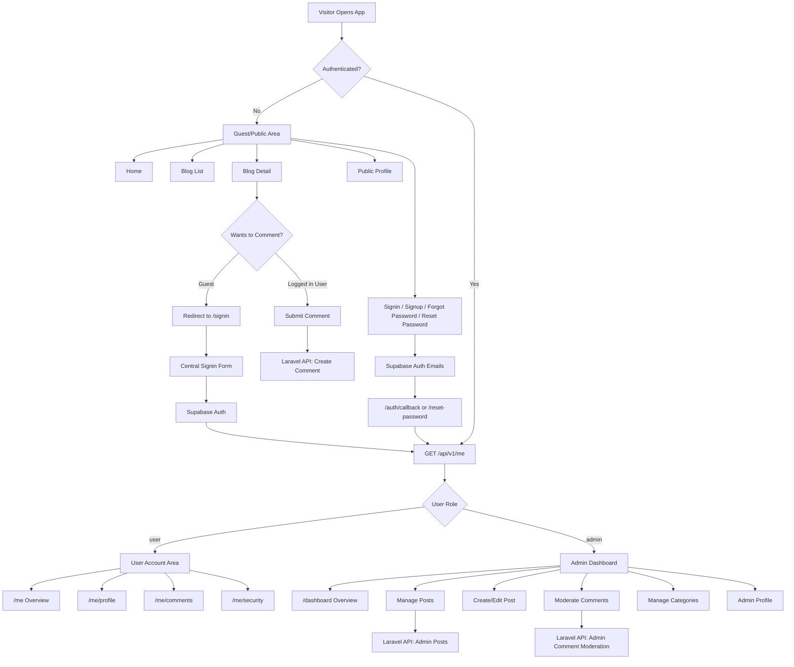

# Frontend Authentication And Authorization

## Purpose

This document defines the target frontend authentication and authorization structure for the Laravel + Vike React rebuild.

- `apps/web` owns signin, signup, password reset, public profile, user account, and admin dashboard screens.
- `apps/api` owns JSON APIs, Supabase token verification, authorization, policies, models, and persistence.
- `legacy/symfony-blog` is reference-only and must not drive the new auth structure.

## Implementation Progress

```text
1. Frontend auth UI foundation     done
2. Backend/Supabase auth setup     done
3. Frontend auth wiring            done for signup/signin/password recovery
4. Authorization guards/roles      partially started
```

Backend/Supabase setup currently includes the `auth:api` guard, Supabase bearer-token verification through JWKS, local `users.supabase_user_id` mapping, `GET /api/v1/me`, CORS config, JSON `401` behavior for API routes, and the initial admin middleware/role helpers.

Frontend auth wiring currently includes email signup, email confirmation callback handling, Google/GitHub social auth, email/password signin, existing-session signin redirects, last-used social provider hints, forgot-password email requests, and reset-password completion through Supabase Auth.

## Backend Auth Implementation

Protected API routes use Laravel's built-in `auth` middleware with the custom `api` guard:

```php
Route::middleware('auth:api')->group(function () {
    Route::get('/me', \App\Http\Controllers\Api\V1\CurrentUserController::class);
});
```

The backend request flow is:

```text
GET /api/v1/me
└── auth:api middleware
    └── api guard from apps/api/config/auth.php
        └── supabase driver registered in AppServiceProvider
            └── read Authorization: Bearer <token>
                └── SupabaseTokenVerifier verifies token through JWKS
                    └── claims.sub maps to users.supabase_user_id
                        └── existing user is resolved by Supabase id or email
                            └── missing local profile fields are synced
                            └── CurrentUserController reads $request->user()
```

Authentication outcomes:

```text
No token      -> guard returns null -> 401
Invalid token -> guard returns null -> 401
Valid token   -> guard returns User -> controller runs
```

Supabase Auth remains the identity source. Laravel does not store passwords or implement password login/register for this rebuild. Laravel stores the local app user record, role, profile metadata, and future relationships such as post authorship.

Local users include a unique `handle`. Email signup sends the requested handle in Supabase metadata. Social signup/signin generates a local handle from provider metadata or email when one is missing; users can change this later from the account profile flow.

```text
Supabase Auth user id
└── token claims.sub
    └── users.supabase_user_id
        └── local users.id for Laravel relationships
```

## Route Structure

Use one centralized signin and signup experience for every account type.

```text
apps/web
├── Public area
│   ├── /
│   ├── /blog
│   ├── /blog/:slug
│   ├── /profile/:username
│   ├── /signin
│   ├── /signup
│   ├── /forgot-password
│   ├── /reset-password
│   └── /auth/callback
│
├── User account area
│   ├── /me
│   ├── /me/profile
│   ├── /me/comments
│   └── /me/security
│
└── Admin dashboard
    ├── /dashboard
    ├── /dashboard/posts
    ├── /dashboard/posts/new
    ├── /dashboard/posts/:id/edit
    ├── /dashboard/comments
    ├── /dashboard/categories
    └── /dashboard/profile
```

## Role Behavior

```text
Guest
├── Read blog posts
├── View public profiles
├── View approved comments
└── Redirect to /signin when trying to comment

User
├── Everything Guest can do
├── Add comments
├── Track own comments
├── Manage own profile
└── Cannot access /dashboard

Admin
├── Everything User can do
├── Access /dashboard
├── Create/edit/delete posts
├── Moderate comments
└── Manage categories
```

## Signin Flow

```text
/signin
├── Email/password signin
│   └── Supabase signInWithPassword
│       └── frontend receives auth session/token
│           └── call Laravel: GET /api/v1/me
│               ├── role: admin -> redirect /dashboard
│               └── role: user -> redirect /
│
├── Existing Supabase session
│   └── call Laravel: GET /api/v1/me
│       ├── role: admin -> redirect /dashboard
│       └── role: user -> redirect /
│
└── Google/GitHub social signin
    └── Supabase OAuth redirects to /auth/callback
        └── callback silently exchanges provider code/token
            └── call Laravel: GET /api/v1/me
                ├── role: admin -> redirect /dashboard
                └── role: user -> redirect /
```

The `/auth/callback` route is user-visible for email confirmation and error states. Normal social signin/signup provider callbacks are processed silently and redirected immediately.

## Signup Flow

```text
/signup
├── Email/password signup
│   └── Supabase signUp with display_name and handle metadata
│       ├── no session -> show email confirmation state
│       └── session -> call Laravel: GET /api/v1/me -> redirect /
│
└── Google/GitHub social signup
    └── Supabase OAuth redirects to /auth/callback
        └── callback exchanges provider code/token
            └── call Laravel: GET /api/v1/me
                ├── create/sync local user
                ├── remember last used provider
                ├── role: admin -> redirect /dashboard
                └── role: user -> redirect /
```

Email confirmation links also return to `/auth/callback`, which restores the Supabase session, syncs the local Laravel user, and redirects by role.

## Password Recovery Flow

Password recovery is Supabase-owned and does not use a Laravel password reset endpoint.

```text
/forgot-password
└── Supabase resetPasswordForEmail
    └── redirectTo: <frontend origin>/reset-password
        └── show neutral "check your email" confirmation state

/reset-password
└── restore Supabase recovery session from ?code=... or #access_token=...
    └── user enters new password and confirmation
        └── Supabase updateUser({ password })
            └── sign out after password update
                └── show success state with link to /signin
```

Recovery UI must not reveal whether an email address exists. Use neutral copy such as:

```text
If an account exists for that email, we sent a reset link.
```

Supabase dashboard configuration must allow these frontend redirect URLs during local development:

```text
http://localhost:3000/auth/callback
http://localhost:3000/reset-password
```

Production should add the matching HTTPS URLs. Auth emails are sent through Supabase Auth. When using Mailtrap or another SMTP provider, configure custom SMTP in Supabase, not Laravel.

## Current Account Redirect Note

The target account area includes `/me`, but the current frontend implementation redirects normal authenticated users to `/` until the account overview screen exists. Admin users redirect to `/dashboard`.

## Frontend Folder Structure

Keep route files thin and put behavior in feature folders.

```text
apps/web/src
├── features
│   ├── auth
│   │   ├── components
│   │   ├── hooks
│   │   ├── api
│   │   └── types.ts
│   ├── account
│   ├── admin
│   ├── blog
│   ├── comments
│   └── profile
│
├── layouts
│   ├── AppShell.tsx
│   ├── AuthShell.tsx
│   ├── AccountLayout.tsx
│   └── DashboardShell.tsx
│
├── lib
│   ├── api
│   ├── auth
│   └── env
│
└── components
    ├── ui
    ├── common
    └── layout
```

## API Touchpoints

The frontend should rely on these backend capabilities:

```text
Public
├── GET /api/v1/posts
├── GET /api/v1/posts/{slug}
├── GET /api/v1/posts/{slug}/comments
├── GET /api/v1/profiles/{username}
└── GET /api/v1/categories

Authenticated user
├── GET /api/v1/me
├── PATCH /api/v1/me
├── GET /api/v1/me/comments
├── POST /api/v1/posts/{slug}/comments
├── PATCH /api/v1/comments/{id}
└── DELETE /api/v1/comments/{id}

Admin
├── GET /api/v1/admin/posts
├── POST /api/v1/admin/posts
├── PATCH /api/v1/admin/posts/{id}
├── DELETE /api/v1/admin/posts/{id}
├── GET /api/v1/admin/comments
├── PATCH /api/v1/admin/comments/{id}/moderation
└── CRUD /api/v1/admin/categories
```

## Mermaid Visualization

Paste this into Mermaid Live Editor: https://mermaid.live



## Acceptance Checks

- Guest users can read posts and public profiles.
- Guest users are redirected to `/signin` when trying to comment.
- Normal users can comment and view their own comment history.
- Normal users cannot access `/dashboard`.
- Admin users can access `/dashboard` from the same signin flow.
- Admin-only API calls are rejected unless `GET /api/v1/me` resolves an admin role.
- Email signup can request a handle and sync a local user after confirmation.
- Google/GitHub signup and signin create or sync the same local Laravel user.
- Email/password signin redirects normal users to `/` and admins to `/dashboard`.
- Forgot-password requests do not reveal whether the email exists.
- Reset-password links land on `/reset-password`, update the Supabase password, sign out, and return the user to signin.
