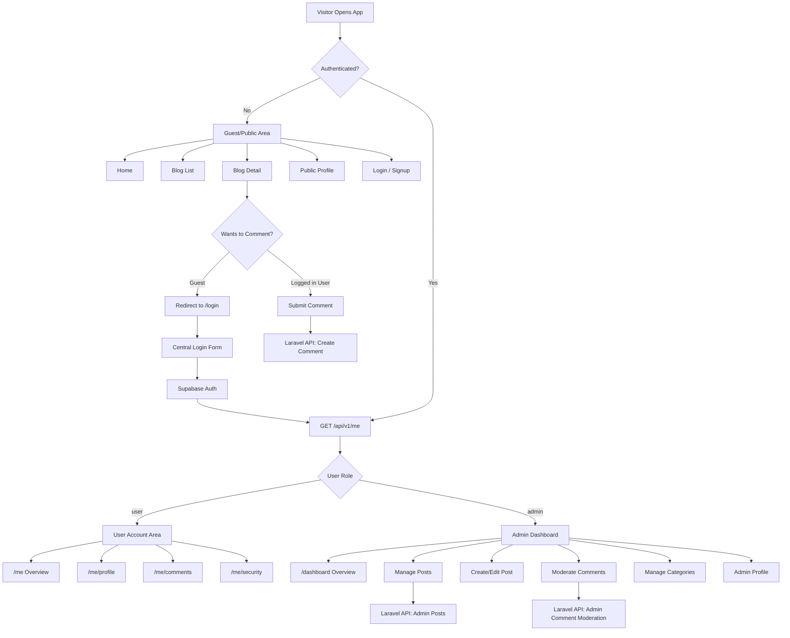

# Frontend Authentication And Authorization

## Purpose

This document defines the target frontend authentication and authorization structure for the Laravel + Vike React rebuild.

- `apps/web` owns login, signup, public profile, user account, and admin dashboard screens.
- `apps/api` owns JSON APIs, Supabase token verification, authorization, policies, models, and persistence.
- `legacy/symfony-blog` is reference-only and must not drive the new auth structure.

## Route Structure

Use one centralized login and signup experience for every account type.

```text
apps/web
├── Public area
│   ├── /
│   ├── /blog
│   ├── /blog/:slug
│   ├── /profile/:username
│   ├── /login
│   └── /signup
│
├── User account area
│   ├── /me
│   ├── /me/profile
│   ├── /me/comments
│   └── /me/security
│
└── Admin dashboard
    ├── /dashboard
    ├── /dashboard/posts
    ├── /dashboard/posts/new
    ├── /dashboard/posts/:id/edit
    ├── /dashboard/comments
    ├── /dashboard/categories
    └── /dashboard/profile
```

## Role Behavior

```text
Guest
├── Read blog posts
├── View public profiles
├── View approved comments
└── Redirect to /login when trying to comment

User
├── Everything Guest can do
├── Add comments
├── Track own comments
├── Manage own profile
└── Cannot access /dashboard

Admin
├── Everything User can do
├── Access /dashboard
├── Create/edit/delete posts
├── Moderate comments
└── Manage categories
```

## Login Flow

```text
/login
└── Supabase login
    └── frontend receives auth session/token
        └── call Laravel: GET /api/v1/me
            ├── role: admin -> redirect /dashboard
            ├── role: user + returnUrl -> redirect back
            └── role: user no returnUrl -> redirect /me
```

## Frontend Folder Structure

Keep route files thin and put behavior in feature folders.

```text
apps/web/src
├── features
│   ├── auth
│   │   ├── components
│   │   ├── hooks
│   │   ├── api
│   │   └── types.ts
│   ├── account
│   ├── admin
│   ├── blog
│   ├── comments
│   └── profile
│
├── layouts
│   ├── PublicLayout.tsx
│   ├── AuthLayout.tsx
│   ├── AccountLayout.tsx
│   └── DashboardLayout.tsx
│
├── lib
│   ├── api
│   ├── auth
│   └── env
│
└── components
    ├── ui
    └── common
```

## API Touchpoints

The frontend should rely on these backend capabilities:

```text
Public
├── GET /api/v1/posts
├── GET /api/v1/posts/{slug}
├── GET /api/v1/posts/{slug}/comments
├── GET /api/v1/profiles/{username}
└── GET /api/v1/categories

Authenticated user
├── GET /api/v1/me
├── PATCH /api/v1/me
├── GET /api/v1/me/comments
├── POST /api/v1/posts/{slug}/comments
├── PATCH /api/v1/comments/{id}
└── DELETE /api/v1/comments/{id}

Admin
├── GET /api/v1/admin/posts
├── POST /api/v1/admin/posts
├── PATCH /api/v1/admin/posts/{id}
├── DELETE /api/v1/admin/posts/{id}
├── GET /api/v1/admin/comments
├── PATCH /api/v1/admin/comments/{id}/moderation
└── CRUD /api/v1/admin/categories
```

## Mermaid Visualization

Paste this into Mermaid Live Editor: https://mermaid.live



## Acceptance Checks

- Guest users can read posts and public profiles.
- Guest users are redirected to `/login` when trying to comment.
- Normal users can comment and view their own comment history.
- Normal users cannot access `/dashboard`.
- Admin users can access `/dashboard` from the same login flow.
- Admin-only API calls are rejected unless `GET /api/v1/me` resolves an admin role.
