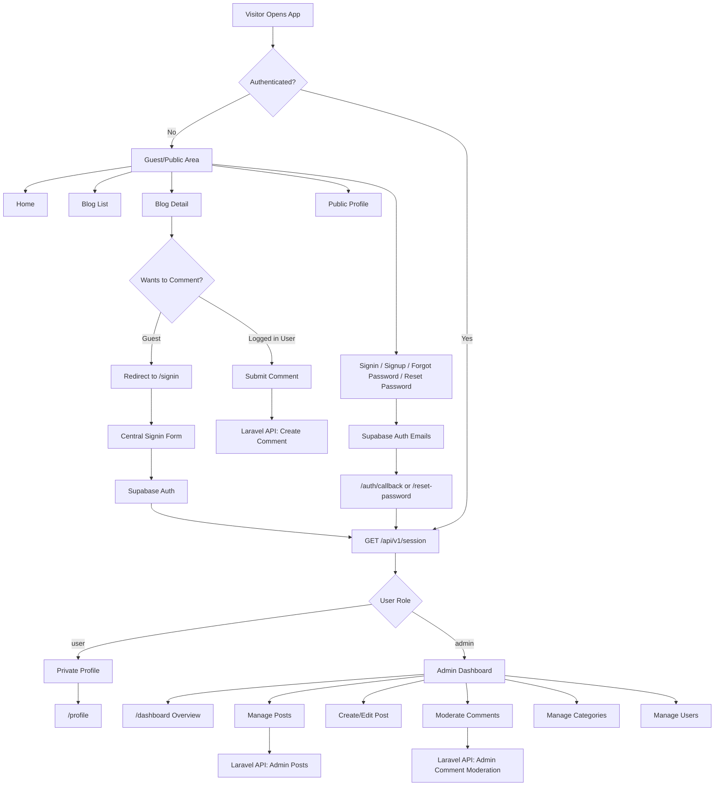

# Frontend Authentication And Authorization

## Purpose

This document defines the target frontend authentication and authorization structure for the Laravel + Vike React rebuild.

- `apps/web` owns signin, signup, password reset, private profile, public profile, and admin dashboard screens.
- `apps/api` owns JSON APIs, Supabase token verification, authorization, policies, models, and persistence.
- `legacy/symfony-blog` is reference-only and must not drive the new auth structure.

## Implementation Progress

```text
1. Frontend auth UI foundation     done
2. Backend/Supabase auth setup     done
3. Frontend auth wiring            done for signup/signin/password recovery
4. Backend authorization scaffold  done for current routes
5. Backend authorization tests     done with Pest route and role coverage
6. Frontend session provider       done
7. Frontend route guards           done for guest/user/admin route groups
8. Frontend profile wiring         done for private /profile
9. Frontend auth visibility        done for header account/admin states
```

Backend/Supabase setup currently includes the `auth:api` guard, Supabase bearer-token verification through JWKS, local `users.supabase_user_id` mapping, the current-user session endpoint, CORS config, JSON `401` behavior for API routes, and the initial admin middleware/role helpers.

Frontend auth wiring currently includes email signup, email confirmation callback handling, Google/GitHub social auth, email/password signin, guest-only auth pages, last-used social provider hints, forgot-password email requests, reset-password completion through Supabase Auth, a current-session provider, role-aware header state, protected user/admin route groups, and private profile load/update wiring.

## Backend Auth Implementation

Protected API routes use Laravel's built-in `auth` middleware with the custom `api` guard:

```php
Route::middleware('auth:api')->group(function () {
    Route::get('/session', [\App\Http\Controllers\Api\V1\SessionController::class, 'show']);
});
```

The backend request flow is:

```text
GET /api/v1/session
└── auth:api middleware
    └── api guard from apps/api/config/auth.php
        └── supabase driver registered in AppServiceProvider
            └── read Authorization: Bearer <token>
                └── SupabaseTokenVerifier verifies token through JWKS
                    └── claims.sub maps to users.supabase_user_id
                        └── existing user is resolved by Supabase id or email
                            └── missing local profile fields are synced
                            └── SessionController reads $request->user()
```

Authentication outcomes:

```text
No token      -> guard returns null -> 401
Invalid token -> guard returns null -> 401
Valid token   -> guard returns User -> controller runs
```

Supabase Auth remains the identity source. Laravel does not store passwords or implement password login/register for this rebuild. Laravel stores the local app user record, role, profile metadata, and future relationships such as post authorship.

Local users include a unique `handle`. Email signup sends the requested handle in Supabase metadata. Social signup/signin generates a local handle from provider metadata or email when one is missing; users can change this later from the private profile flow.

```text
Supabase Auth user id
└── token claims.sub
    └── users.supabase_user_id
        └── local users.id for Laravel relationships
```

## Route Structure

Use one centralized signin and signup experience for every account type.

```text
apps/web
├── Public area
│   ├── /
│   ├── /blog
│   ├── /blog/:slug
│   ├── /profile/:handle
│   ├── /signin
│   ├── /signup
│   ├── /forgot-password
│   ├── /reset-password
│   └── /auth/callback
│
├── Private user profile
│   └── /profile
│
└── Admin dashboard, admin only
    ├── /dashboard
    ├── /dashboard/posts
    ├── /dashboard/posts/new
    ├── /dashboard/posts/:id/edit
    ├── /dashboard/users
    ├── /dashboard/comments
    └── /dashboard/categories
```

`/profile` is the signed-in user's private profile/settings page. It can include fields from `design/profile.html`, such as email, password update, notification settings, comment history, reading history, and account deletion.

`/profile/:handle` is a public user profile page. It must expose only safe public fields such as display name, handle, avatar, bio, public links, public comment count, and member-since date. It must not expose email, password controls, notification settings, reading history, or account deletion.

There is no frontend `/me` route. Current-user identity is an API concern.

## Role Behavior

```text
Guest
├── Read blog posts
├── View public profiles
├── View approved comments
└── Redirect to /signin when trying to comment

User
├── Everything Guest can do
├── Add comments
├── View and update own private /profile
└── Cannot access /dashboard

Admin
├── Everything User can do
├── Access /dashboard
├── Create/edit/delete posts
├── Manage users
├── Moderate comments
└── Manage categories
```

## Backend Authorization Scaffold

The backend authorization scaffold is intentionally separate from future admin product logic.

Done in this phase:

```text
GET /api/v1/session
GET /api/v1/profile
PATCH /api/v1/profile
DELETE /api/v1/profile
GET /api/v1/profiles/{handle}
GET /api/v1/admin/posts
POST /api/v1/admin/posts
PATCH /api/v1/admin/posts/{post}
DELETE /api/v1/admin/posts/{post}
GET /api/v1/admin/users
PATCH /api/v1/admin/users/{user}
GET /api/v1/admin/comments
PATCH /api/v1/admin/comments/{comment}
GET /api/v1/admin/categories
POST /api/v1/admin/categories
PATCH /api/v1/admin/categories/{category}
DELETE /api/v1/admin/categories/{category}
POST /api/v1/admin/uploads
```

Admin controller placeholders prove the route and middleware boundary. Real admin business logic comes later by feature area: post publishing, user moderation, comment moderation, category management, media uploads, and website stats.

Controllers should use resource-style method names: `index`, `store`, `show`, `update`, and `destroy`. Avoid action-specific method names such as `moderate`; represent moderation as a resource update unless the action truly needs a separate endpoint.

## Signin Flow

```text
/signin
├── Email/password signin
│   └── Supabase signInWithPassword
│       └── frontend receives auth session/token
│           └── call Laravel: GET /api/v1/session
│               └── redirect /
│
├── Existing Supabase session
│   └── call Laravel: GET /api/v1/session
│       └── redirect /
│
└── Google/GitHub social signin
    └── Supabase OAuth redirects to /auth/callback
        └── callback silently exchanges provider code/token
            └── call Laravel: GET /api/v1/session
                └── redirect /
```

The `/auth/callback` route is user-visible for email confirmation and error states. Normal social signin/signup provider callbacks are processed silently and redirected immediately.

## Signup Flow

```text
/signup
├── Email/password signup
│   └── Supabase signUp with display_name and handle metadata
│       ├── no session -> show email confirmation state
│       └── session -> call Laravel: GET /api/v1/session -> redirect /
│
└── Google/GitHub social signup
    └── Supabase OAuth redirects to /auth/callback
        └── callback exchanges provider code/token
            └── call Laravel: GET /api/v1/session
                ├── create/sync local user
                ├── remember last used provider
                └── redirect /
```

Email confirmation links also return to `/auth/callback`, which restores the Supabase session, syncs the local Laravel user, and redirects by role.

## Password Recovery Flow

Password recovery is Supabase-owned and does not use a Laravel password reset endpoint.

```text
/forgot-password
└── Supabase resetPasswordForEmail
    └── redirectTo: <frontend origin>/reset-password
        └── show neutral "check your email" confirmation state

/reset-password
└── restore Supabase recovery session from ?code=... or #access_token=...
    └── user enters new password and confirmation
        └── Supabase updateUser({ password })
            └── sign out after password update
                └── show success state with link to /signin
```

Recovery UI must not reveal whether an email address exists. Use neutral copy such as:

```text
If an account exists for that email, we sent a reset link.
```

Supabase dashboard configuration must allow these frontend redirect URLs during local development:

```text
http://localhost:3000/auth/callback
http://localhost:3000/reset-password
```

Production should add the matching HTTPS URLs. Auth emails are sent through Supabase Auth. When using Mailtrap or another SMTP provider, configure custom SMTP in Supabase, not Laravel.

## Current Login Redirect Note

Successful signin, signup, and auth callback flows redirect by resolved backend permissions:

```text
Normal user -> /
Admin user  -> /dashboard
```

Guest-only auth pages (`/signin`, `/signup`, `/forgot-password`, and `/reset-password`) do not render their auth UI for already signed-in users. They use the current frontend session state to send normal users to `/` and admins to `/dashboard`.

## Frontend Folder Structure

Keep route files thin and put behavior in feature folders.

```text
apps/web/src
├── features
│   ├── auth
│   │   ├── components
│   │   ├── hooks
│   │   ├── api
│   │   └── types.ts
│   ├── admin
│   ├── blog
│   ├── comments
│   └── profile
│
├── layouts
│   ├── AppShell.tsx
│   ├── AuthShell.tsx
│   └── DashboardShell.tsx
│
├── lib
│   ├── api
│   ├── auth
│   └── env
│
└── components
    ├── ui
    ├── common
    └── layout
```

## API Touchpoints

The frontend should rely on these backend capabilities:

```text
Public
├── GET /api/v1/posts
├── GET /api/v1/profiles/{handle}
├── GET /api/v1/categories
└── POST /api/v1/posts/{slug}/view

Authenticated user
├── GET /api/v1/session
├── GET /api/v1/profile
├── PATCH /api/v1/profile
└── DELETE /api/v1/profile

Admin
├── GET /api/v1/admin/posts
├── POST /api/v1/admin/posts
├── PATCH /api/v1/admin/posts/{id}
├── DELETE /api/v1/admin/posts/{id}
├── GET /api/v1/admin/comments
├── PATCH /api/v1/admin/comments/{id}
├── GET /api/v1/admin/users
├── PATCH /api/v1/admin/users/{id}
├── CRUD /api/v1/admin/categories
└── POST /api/v1/admin/uploads
```

## Mermaid Visualization

Paste this into Mermaid Live Editor: https://mermaid.live



## Current Branch Acceptance Checks

- Guest users can read posts and public profiles.
- Guest users are rejected from authenticated API endpoints.
- Normal users can manage their private `/profile`.
- Public `/profile/:handle` never exposes private profile settings or auth fields.
- Normal users cannot access `/dashboard`.
- Admin users can access `/dashboard` after signing in.
- Admin-only API calls are rejected unless `GET /api/v1/session` resolves an admin role.
- Email signup can request a handle and sync a local user after confirmation.
- Google/GitHub signup and signin create or sync the same local Laravel user.
- Email/password signin redirects normal users to `/` and admin users to `/dashboard`.
- Signed-in users cannot view guest-only auth pages.
- Forgot-password requests do not reveal whether the email exists.
- Reset-password links land on `/reset-password`, update the Supabase password, sign out, and return the user to signin.

## Future Feature Acceptance Checks

- Guest users are redirected to `/signin` when trying to comment.
- Normal users can add comments.
- Comment edit/delete buttons are visible only to the comment owner or an admin.
- Admin users can create/edit/delete posts, manage users, moderate comments, manage categories, upload media, and review dashboard stats once those business features are implemented.
