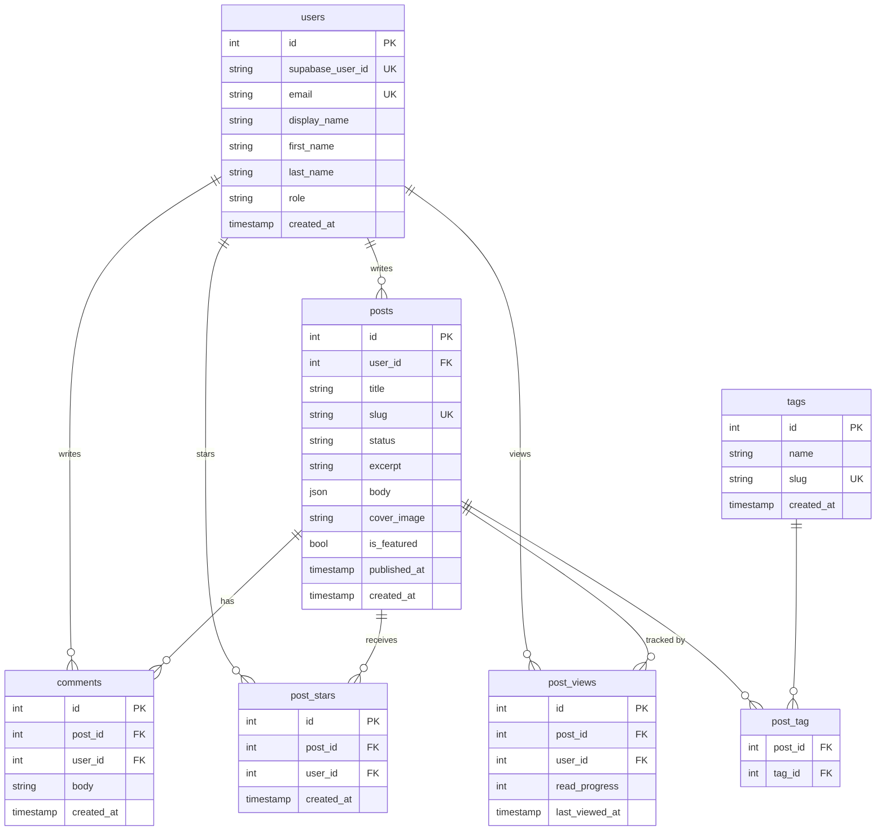

# Domain Model

## Core Entities

### users

- `id`: local primary key
- `supabase_user_id`: unique foreign identity reference
- `email`
- `display_name`
- `first_name`
- `last_name`
- `avatar_url`
- `role`
- `created_at`
- `updated_at`

Notes:

- Supabase Auth is the identity source.
- Local user records store app-specific metadata and authorization fields.

### tags

- `id`
- `name`
- `slug`
- `created_at`
- `updated_at`

### posts

- `id`
- `user_id`
- `title`
- `slug`
- `status`
- `excerpt` nullable
- `body` JSON block array from the blogEditor `BlockElement[]` contract
- `cover_image` nullable
- `is_featured`
- `published_at` nullable
- `created_at`
- `updated_at`

Status defaults:

- `draft`
- `published`
- `archived` only if later needed

### post_tag

- `post_id`
- `tag_id`
- `created_at`
- `updated_at`

### post_stars

- `id`
- `post_id`
- `user_id`
- `created_at`
- `updated_at`

### media assets

Use a separate table only if the app needs searchable upload records, ownership, or moderation state. Otherwise store public cover image references directly on posts as `cover_image`.

## Relationships

- one user has many posts
- one post has many comments through `comments.post_id`
- one post has many tags through `post_tag`
- one tag has many posts through `post_tag`
- one post has many stars through `post_stars`
- one user can star many posts through `post_stars`

## Entity Relationship Diagram

## Legacy Mapping

- `Account` -> `users`
- `Blog` -> `posts`
- legacy category/tag concepts -> `tags`
- legacy HTML content fields -> blogEditor block JSON in `posts.body`
- `htmlThumbnail` -> `cover_image`

## Constraints

- `users.supabase_user_id` must be unique
- `users.email` must be unique
- `tags.slug` must be unique
- `posts.slug` must be unique
- `post_tag` must be unique by `post_id` and `tag_id`
- `post_stars` must be unique by `post_id` and `user_id`
