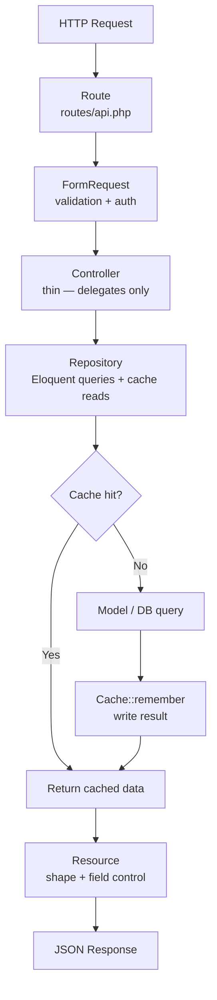
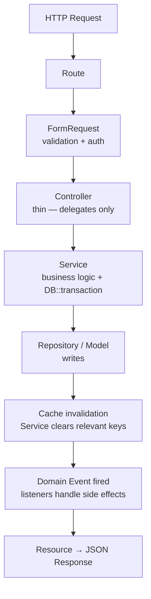
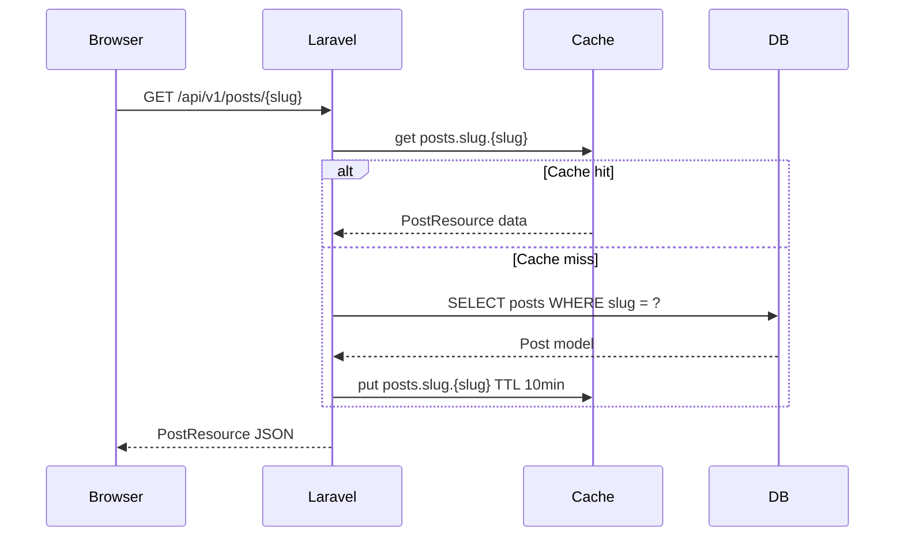
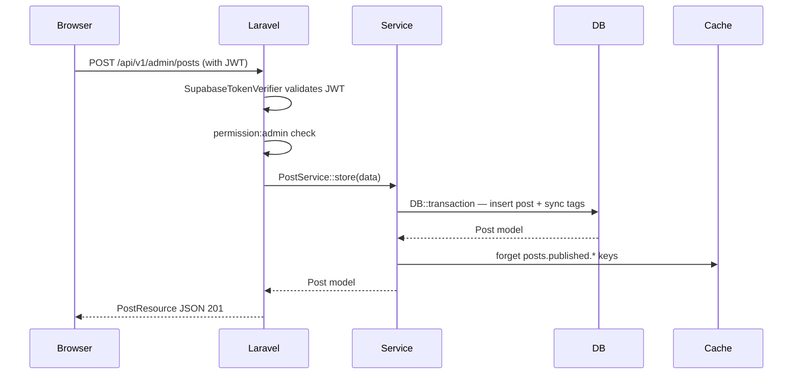

# Post Structure

## Purpose

This document defines the structure, data flow, and implementation status for the post feature across public blog pages and the admin post management surface.

- `/blog` — public post listing (no auth required)
- `/blog/@slug` — public post detail (no auth required)
- `/admin/posts` — admin post CRUD (admin role required)

## Implementation Progress

```text
Phase legend: ✅ done  ⚠️ partial  ⏳ pending
```

| Section | Design | Backend | Wiring | Tests |
|---|---|---|---|---|
| Public post listing (`/blog`) | ⏳ | ✅ | ⏳ | ✅ |
| Public post detail (`/blog/@slug`) | ⏳ | ✅ | ⏳ | ✅ |
| Admin post CRUD (`/admin/posts`) | ⏳ | ✅ | ⏳ | ⏳ |

### Notes

- **Public listing backend** — `GET /api/v1/posts` via `PublicPostController::index`, returns paginated `PostSummaryResource` with author, tags, comments_count, stars_count.
- **Public detail backend** — `GET /api/v1/posts/{slug}` via `PublicPostController::show`, returns `PostResource` (extends summary + `body`).
- **Admin CRUD backend** — `GET/POST/PATCH/DELETE /api/v1/admin/posts` via `Admin\PostController`, auth-gated behind `auth:api` + `admin` middleware, auto-sets `published_at` on first publish.
- **Frontend** — both `pages/blog/+Page.tsx` and `pages/blog/@slug/+Page.tsx` are empty shells (`<h1>` placeholder only). `features/blog/` contains only a `.gitkeep`. No admin frontend pages exist yet.
- **Admin tests** — no behavior tests for admin post endpoints yet; only public endpoint tests in `tests/Feature/Public/PostEndpointTest.php`.

### Backend Gaps

- **Missing `PostService`** — `Admin\PostController` contains business logic inline (`postData()` private method handles `published_at` auto-set and strips `tag_ids`). This must be extracted to `app/Services/Post/PostService.php` before the admin wiring phase. Controllers must be thin — validate input, call service, return resource.
- **No service layer for public post controllers** — `PublicPostController` queries the model directly. Acceptable for now (read-only, no logic), but any future filtering, caching, or view tracking logic must go into `PostService`, not the controller.

## Request Flow Diagrams

### Backend layer stack (read request)



### Backend layer stack (write request)



### Public post read flow



### Admin post write flow



## Routes

```text
Public (no auth)
├── GET  /api/v1/posts              — paginated post listing (PostSummaryResource)
└── GET  /api/v1/posts/{slug}       — single post detail (PostResource)

Authenticated user
├── POST   /api/v1/posts/{slug}/view    — record post view (202, placeholder)
├── POST   /api/v1/posts/{slug}/stars   — star a post
└── DELETE /api/v1/posts/{slug}/stars   — unstar a post

Admin only
├── GET    /api/v1/admin/posts          — paginated post list with counts
├── POST   /api/v1/admin/posts          — create post
├── PATCH  /api/v1/admin/posts/{post}   — update post
└── DELETE /api/v1/admin/posts/{post}   — delete post
```

## Key Files

```text
Backend
├── app/Http/Controllers/Api/V1/PublicPostController.php
├── app/Http/Controllers/Api/V1/Admin/PostController.php
├── app/Http/Controllers/Api/V1/PostStarController.php
├── app/Http/Resources/PostSummaryResource.php
├── app/Http/Resources/PostResource.php
├── app/Http/Requests/Admin/StorePostRequest.php
├── app/Http/Requests/Admin/UpdatePostRequest.php
└── tests/Feature/Public/PostEndpointTest.php

Frontend
├── pages/blog/+Page.tsx                 — empty shell
├── pages/blog/@slug/+Page.tsx           — empty shell
├── pages/blog/@slug/+config.ts
└── features/blog/                       — empty (.gitkeep only)
```

## Resource Shape

### PostSummaryResource (listing)

```text
id, user_id, title, slug, excerpt, cover_image, reading_time,
is_featured, status, published_at, created_at, updated_at,
author { id, display_name, handle, avatar_url },
tags[],
comments_count, stars_count
```

### PostResource (detail)

Extends `PostSummaryResource` + `body`.
