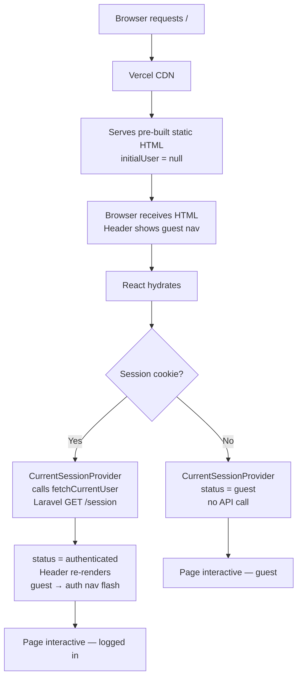
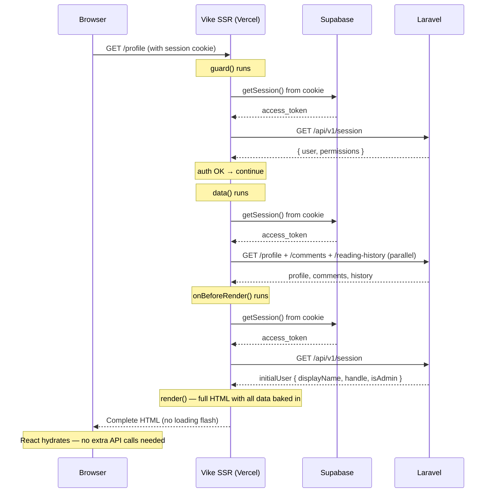
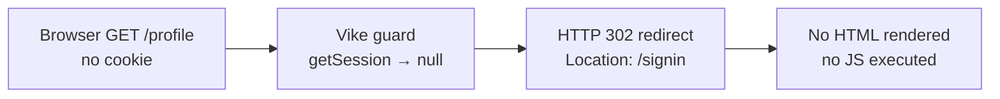

# Supabase SSR Auth

## Purpose

Migrate the frontend from `supabase-js` localStorage-based sessions to `@supabase/ssr` cookie-based sessions, enabling true server-side auth gating in Vike via `+guard.ts` files.

- Eliminates the "Checking your session..." loading flash on hard refresh.
- Enables PHP-style server-side auth gates: Vercel SSR validates the session before rendering any protected page.
- Required before production deployment on Vercel — localStorage is client-only and cannot be read during SSR.

## Deployment Context

- **Frontend:** Vercel (Vike + React SSR, Node.js serverless)
- **Backend:** Render (Laravel 12 JSON API, JWT auth via Supabase JWKS)
- **Auth:** Supabase (currently localStorage, migrating to cookies)

## Implementation Progress

```text
1. @supabase/ssr setup         done — @supabase/ssr@0.10.3 installed, supabaseClient.ts replaced with
                               createBrowserClient, supabaseServerClient.ts factory created with
                               getAll/setAll cookie adapter (read-only in guard context)
2. Server-side guards          done — single global pages/+guard.ts reads accessLevel from route config
                               and enforces redirect rules for all four levels: public / guest-only /
                               auth-required / admin-required. Per-group +guard.ts files removed.
3. Prerender config            done — prerender: false in all protected route group +config.ts files;
                               accessLevel declared via meta in pages/+config.ts so Vike accepts the field
4. Session context update      done — CurrentSessionProvider uses same supabase import; createBrowserClient
                               reads cookies on INITIAL_SESSION, eliminating localStorage loading flash
5. Server-side data fetching   done — pages/(user)/profile/+data.ts fetches profile, comments, and
                               reading-history in parallel server-side; uses resolveServerAuth() for
                               session resolution; components accept initialX props; zero loading flash
6. Auth callback update        pending — verify /auth/callback sets cookies correctly post-OAuth
7. Tests and verification      pending — manual verification of no loading flash, correct server redirects,
                               cookie persistence after OAuth
```

## Route and Auth

Implemented:
- `pages/+guard.ts` — single global server-side guard, reads `pageContext.config.accessLevel`, enforces redirects for all route groups
- `pages/(auth)/+config.ts` — declares `accessLevel: 'guest-only'`; redirects authenticated users to `/` except `/reset-password` and `/auth/callback`
- `pages/(user)/+config.ts` — declares `accessLevel: 'auth-required'`; redirects guests to `/signin`
- `pages/(admin)/+config.ts` — declares `accessLevel: 'admin-required'`; redirects guests to `/signin`, non-admins to `/`
- Session stored in cookies by `@supabase/ssr`
- `RequireAuth` and `RequireGuest` components deprecated; `RequireAdmin` kept as client-side hydration fallback only

## Key Files

```text
apps/web/src/lib/auth/serverAuth.ts              — resolveServerAuth(): single session resolver for all server hooks
apps/web/src/lib/auth/supabaseClient.ts          — browser client (createBrowserClient from @supabase/ssr)
apps/web/src/lib/auth/supabaseServerClient.ts    — server client factory (read-only cookie adapter)
apps/web/src/features/auth/guards/AuthGuard.tsx  — @deprecated, replaced by +guard.ts
apps/web/src/features/auth/guards/RequireAuth.tsx — @deprecated, replaced by +guard.ts
apps/web/src/features/auth/guards/RequireGuest.tsx — @deprecated, replaced by +guard.ts
apps/web/src/features/auth/guards/RequireAdmin.tsx — client-side hydration fallback only; not the primary gate
apps/web/pages/+guard.ts                         — global server-side guard for all routes
apps/web/pages/+config.ts                        — accessLevel: 'public' default; meta registration; passToClient
apps/web/pages/(auth)/+config.ts                 — accessLevel: 'guest-only', prerender: false
apps/web/pages/(user)/+config.ts                 — accessLevel: 'auth-required', prerender: false
apps/web/pages/(admin)/+config.ts                — accessLevel: 'admin-required', prerender: false
apps/web/pages/(user)/+Layout.tsx               — wraps in AppShell only, no auth wrapper
apps/web/pages/(auth)/+Layout.tsx               — wraps in AuthShell only, no auth wrapper
apps/web/pages/(admin)/+Layout.tsx              — wraps in RequireAdmin (client fallback) + DashboardShell
apps/web/pages/(user)/profile/+data.ts          — SSR data fetch using resolveServerAuth()
apps/web/pages/+onBeforeRender.ts               — global SSR hook using resolveServerAuth() → pageContext.initialUser
apps/web/src/vike.d.ts                          — AccessLevel type; Config and PageContext augmentation
```

## Request Flow Diagrams

### Public prerendered page (e.g. `/`) — guest vs authenticated



### Auth-required page (e.g. `/profile`) — SSR per request



### Guest visiting auth-required page



## Vike Hook Execution Order

In Vike 0.4, server-side hooks execute in this order per request:

```
guard() → data() → onBeforeRender() → render()
```

**Critical constraint:** `data()` runs **before** `onBeforeRender()`. Any value set on `pageContext` inside `onBeforeRender` is not yet available when `data()` executes.

This means `+data.ts` must resolve the session independently — it cannot rely on a value set by `guard()` or `onBeforeRender()`. All three hooks call `resolveServerAuth(pageContext)` from `src/lib/auth/serverAuth.ts`, which encapsulates the Supabase client creation, `getSession()` call, and `fetchCurrentUser()` call in one place.

On auth-required/admin-required routes, the profile page performs two `resolveServerAuth()` calls per SSR request (one from `guard()` + one from `onBeforeRender()`), plus one from `data()` if a `+data.ts` exists:

| Hook | Why it calls resolveServerAuth() |
|------|----------------------------------|
| `guard()` | Check whether the user is authenticated; redirect if not |
| `data()` | Get the access token to call Laravel API endpoints |
| `onBeforeRender()` | Get the user data to populate `pageContext.initialUser` for the Header |

This redundancy is a known constraint of Vike's stateless hook model. Each hook receives a fresh `pageContext` with no shared mutable state between hooks. A future optimisation could cache the result on `pageContext.serverAuth` via a custom Vike server, but that is out of scope for the current architecture.

## Acceptance Checks

- Hard refresh on `/profile` renders the full page — header with avatar, account form, comment history, reading history — with zero loading flash. All content present in view-source HTML.
- Guest visiting `/profile` is redirected to `/signin` via HTTP 302 (server-side, before HTML is sent) — visible in DevTools Network tab as a 302 response with no HTML body.
- Signed-in user visiting `/signin` is redirected to `/` server-side.
- Main site header renders with correct avatar initial, display name, and account menu on first HTML response across all pages — no blank span flash on any page.
- OAuth callback (`/auth/callback`) correctly sets the session cookie after sign-in. (pending verification)
- Token refresh works transparently — expired tokens are refreshed via the cookie flow.
- All existing profile page features continue to work (account form, notifications, delete, etc.).
